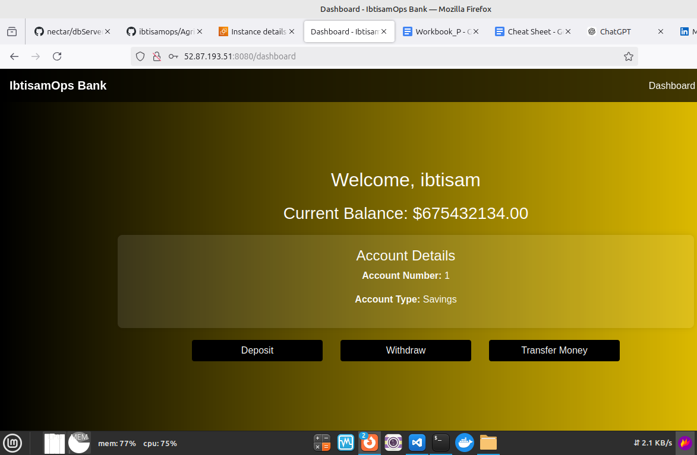

# 3 Tier Spring Boot Bank App with MySQL

## Overview
This project is a Java-based banking application that follows a 3-tier architecture, utilizing a MySQL database. The application is designed to demonstrate a typical enterprise-level banking system with a clear separation of concerns across the presentation, business logic, and data access layers.

### Key Features:
- **Spring Boot**: Utilized for building the backend services.
- **MySQL**: Used as the relational database management system.
- **3-Tier Architecture**: Ensures modularity and separation of concerns.
  - **Presentation Layer**: Handles the user interface and user interaction.
  - **Business Logic Layer**: Contains the core functionality and business rules.
  - **Data Access Layer**: Manages database interactions and data persistence.
- **RESTful APIs**: Provides endpoints for various banking operations.
- **Security**: Implements basic security measures for user authentication and authorization.

### Use Cases:
- **Account Management**: Create, update, and delete bank accounts.
- **Transaction Management**: Perform and track transactions between accounts.
- **User Management**: Handle user registration, login, and profile management.

## Database Configuration
The database configuration is specified in the `application.properties` file located at `src/main/resources/application.properties`. Ensure that the MySQL database is set up and the connection details are correctly configured in this file.

## Project Structure
The project follows a standard Spring Boot structure with the following key directories and files:
- `src/main/java`: Contains the Java source code.
  - `controller`: Handles HTTP requests and responses.
  - `service`: Contains the business logic.
  - `repository`: Manages data access and database interactions.
  - `model`: Defines the data models and entities.
- `src/main/resources`: Contains configuration files and static resources.
  - `application.properties`: Configuration file for database and other settings.

Please refer to `consoleOutput.txt` for more details. 😊

## Project Snapshot


## Getting Started
To get started with the project, follow these steps:

1. **Clone the repository.**
 
2. **Set up the database**:
   - Ensure MySQL is installed and running.
   - Create a database named `banking_app`. To set it up, you can follow the guidelines [here](https://github.com/ibtisamops/nectar/blob/main/mysql/MySQL.md).
   - Update the `application.properties` file with your database credentials.

3. **Build and run the application**:
   ```bash
   ./mvnw spring-boot:run
   ```

4. **Access the application**:
   - The application will be accessible at `http://localhost:8080`.
